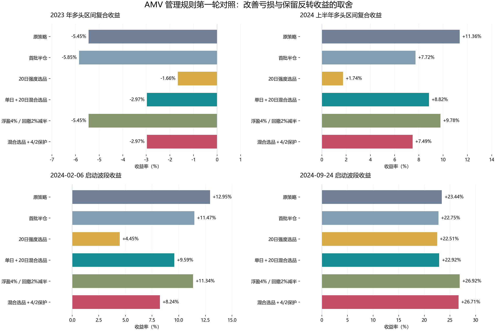

# 分批建仓、选品与部分盈利保护：第一轮结果

沿用用户指定的原成交口径：信号当日收盘成交，不加入费用和滑点；正式策略未修改。

本轮共 16 个预定义方案：12 个基线/单项方案，4 个组合。报告全部结果，不只展示表现最好的一段。

**结果：测试的分批确认规则未改善 2023 年；混合选品有改善但未转正；适度部分保护主要降低全期回撤。尚无方案同时保持全部反转收益并消除弱市亏损。**



## 统计口径

- 多头区间收益：按启动日期分组，将完整已结束交易复合；不含银行 ETF 收益，不是自然年账户收益。
- 账户回撤：2019 年至 2026-09-24 逐日收盘净值，包含原银行规则；每笔持仓按实际份额估值。
- 份额口径逐笔核对了原 TypeScript 引擎的交易收益。旧页面每日曲线按固定权重日收益连乘，与其逐笔买入持有收益并非同一算法，因此这里原策略最大回撤 15.91% 不要求等于旧页面 16.17%。所有实验统一采用可与逐笔收益对账的份额口径；成交时点没有改变。
- 使用现有 ETF 候选池和项目默认参数；不是对用户浏览器临时参数的精确恢复。
- 历史已用于观察，以下均为回顾性比较，不能称作未触碰的盲测。

## 全部实验

| 方案 | 2019—2022多头 | 2023多头 | 2024上半年多头 | 2024下半年多头 | 2025多头 | 2026多头 | 全期账户最大回撤 |
|---|---:|---:|---:|---:|---:|---:|---:|
| 原策略 | 98.58% | -5.45% | 11.36% | 23.22% | 15.45% | 31.28% | 15.91% |
| 首批半仓 | 76.33% | -5.85% | 7.72% | 26.35% | 12.64% | 28.39% | 15.37% |
| 首批三分之一 | 69.42% | -5.99% | 6.52% | 27.39% | 11.72% | 27.40% | 16.07% |
| 弱趋势首批半仓 | 90.20% | -6.92% | 8.64% | 27.28% | 14.59% | 28.18% | 15.39% |
| 弱趋势首批三分之一 | 87.46% | -7.40% | 7.74% | 28.64% | 14.30% | 27.14% | 15.39% |
| 5日强度选品 | 90.14% | -3.84% | 8.41% | 21.70% | 12.17% | 34.11% | 14.35% |
| 20日强度选品 | 128.77% | -1.66% | 1.74% | 25.94% | 40.82% | 19.56% | 17.40% |
| 单日＋20日混合选品 | 107.93% | -2.97% | 8.82% | 27.77% | 28.95% | 43.41% | 16.26% |
| 固定沪深300ETF | 56.77% | -6.04% | 6.54% | 11.20% | 17.20% | 2.82% | 11.28% |
| 浮盈2%／回撤1%减半 | 69.99% | -7.29% | 11.42% | 28.51% | 12.84% | 30.53% | 11.57% |
| 浮盈4%／回撤2%减半 | 101.73% | -5.45% | 9.78% | 26.70% | 13.50% | 28.33% | 13.11% |
| 浮盈5%／回撤3%减半 | 106.36% | -5.45% | 9.78% | 26.70% | 16.83% | 27.21% | 14.38% |
| 弱趋势半仓＋4/2保护 | 93.22% | -6.92% | 7.08% | 30.87% | 12.66% | 25.30% | 11.68% |
| 混合选品＋4/2保护 | 108.22% | -2.97% | 7.49% | 31.71% | 20.84% | 35.18% | 13.09% |
| 混合选品＋弱趋势半仓 | 105.03% | -4.03% | 6.04% | 29.60% | 27.62% | 42.85% | 16.19% |
| 混合选品＋弱趋势半仓＋4/2保护 | 105.32% | -4.03% | 4.74% | 33.60% | 19.59% | 34.64% | 12.26% |

## 规则定义

- 原策略：启动日涨幅前五，仓位 30/30/20/10/10；AMV 原始进出条件不变。
- 分批：首批半仓或三分之一；从下一交易日起，若 AMV 收盘突破启动日最高值，且启动日原组合仍盈利，按当日收盘价格补足剩余资金。只加一次，未确认部分留现金。
- 弱趋势：启动日 AMV 在 MA60 下方，且 MA60 低于五个交易日前；只在满足这两个条件时分批。
- 5日/20日选品：按截至启动日收盘的对应涨幅选前五，权重不变。
- 混合选品：当日涨幅横截面百分位与20日涨幅百分位各占一半，选前五，权重不变。
- 盈利保护：按启动日原组合的收盘净值观察，达到浮盈门槛后，从已发生的最高收盘净值回撤达到门槛时，按当日实际收盘值卖出一半持仓。不是假定卖在门槛价格。另一半沿用原退出。
- 保护仅触发一次，触发后不加仓、不在原区间内重新买入；卖出部分留现金。组合方案采用混合选品、弱趋势半仓和4%/2%保护的固定搭配。

## 为什么分批反而恶化2023年

首批半仓降低了2023-12-29那笔直接下跌交易的损失（-3.78%→-1.89%），但另外几次短暂上涨同样满足加仓条件。
2023-01-30波段在02-01补仓，最终-2.28%→-2.88%；2023-08-28波段在08-29补仓，最终+0.08%→-0.62%。确认条件没有区分持续上涨与短反弹，补仓反而抬高成本。
因此只能否定本轮这些分批规则，不能推论所有分批方式都无效。

## 为什么不选单看2023年最好的20日排名

20日排名将2023年亏损减至-1.66%，但2024上半年多头收益只有+1.74%。2024-02-06大反转波段收益由+12.95%降至+4.46%，说明反转初期的此前弱势资产可能被中期排名排除。

## 为什么保护不能保证不回吐

2%/1%保护把全期回撤降至11.57%，但2023年收益恶化至-7.29%。2023-04-03波段曾达到盈利门槛，04-10收盘已跌到组合-3.59%才触发减半，不能假设成交在盈利保护线上。另一笔10月盈利波段被过早减仓，收益由+5.14%降至+3.00%。
4%/2%保护没有改变2023年的交易，却把全期回撤由15.91%降至13.11%；其价值更接近控制部分大波段回吐，而非修复所有弱市亏损。

## 大反转收益

| 方案 | 2024-02-06波段 | 2024-09-24波段 |
|---|---:|---:|
| 原策略 | 12.95% | 23.44% |
| 首批半仓 | 11.47% | 22.75% |
| 20日强度选品 | 4.45% | 22.51% |
| 单日＋20日混合选品 | 9.59% | 22.92% |
| 浮盈4%／回撤2%减半 | 11.34% | 26.92% |
| 混合选品＋4/2保护 | 8.24% | 26.71% |

## 本轮值得保留的对照

保留原策略、混合选品、混合选品＋4%/2%保护三条对照，不直接替换正式策略。
混合选品降低2023年亏损，但2024上半年收益低于原策略，且全期回撤略高。叠加保护将全期回撤降至13.09%，但2024上半年收益进一步降至7.49%，2月反转波段从原12.95%降至8.24%。
混合选品在2023年只有1笔盈利，而原策略有2笔，但最终亏损更小；胜率不应作为唯一目标。
下一轮如继续，宜检查行业集中度或选择稳定性、保护阈值的小范围稳定性及时间滚动表现，而不是继续叠加许多规则后寻找最漂亮的一条曲线。

## 复现与核验

```powershell
python back_test_data/strategy_failure_research/experiments.py
python -m unittest discover -s back_test_data/strategy_failure_research -p test_experiments.py
python back_test_data/strategy_failure_research/report_experiments.py
```

验证了原策略逐笔收益一致、加仓使用确认日价格、未加仓资金留现金、跳跌不假设按保护价成交、未来价格修改不影响此前净值和操作。
完整结果：experiment_metrics.csv、experiments.json；逐日净值：experiment_nav.csv。
